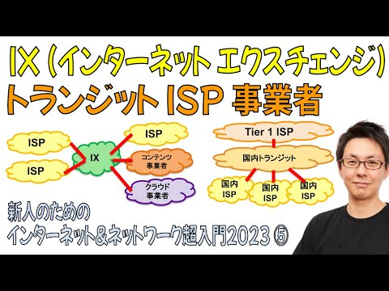
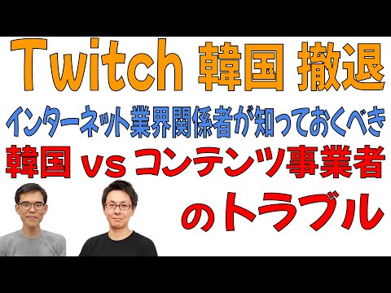

# show int レポート

## 動画名

1. [サイバーエージェントが構築した AI/ML専用インフラのネットワーク要件がヤバすぎた【JANOG52プレゼン解説】](https://www.youtube.com/watch?v=K83YRt_jDY4) ( 2023-10-16 公開)

1. [【超入門2023③】日本のISP (インターネットサービスプロバイダ) を一気に解説](https://www.youtube.com/watch?v=hlGeHJUdGT4) ( 2023-10-23 公開)

1. [「EVPNマルチホーミング」から学ぶ ネットワーク機器 冗長化技術 の過去と未来【JANOG52プレゼン解説】](https://www.youtube.com/watch?v=ssQo608m31o) ( 2023-10-30 公開)

1. [技術についていけなくなる将来の不安に対するアドバイス](https://www.youtube.com/watch?v=GEicptmkEZg) ( 2023-11-06 公開)

1. [ネットワークエンジニアの転職面接でされる質問と対策](https://www.youtube.com/watch?v=8yJnGeNNhZc) ( 2023-11-13 公開)

1. [【超入門2023④】クラウド事業者・データセンタ事業者・CDN事業者・コンテンツ事業者の違いを解説](https://www.youtube.com/watch?v=SX7zeKzT08M) ( 2023-11-20 公開)

1. [最前線で闘うネットワークエンジニア 川上 雄也 さん #標準化 #IETF #RFC #3GPP #AI/ML【エンジニア対談】](https://www.youtube.com/watch?v=t1TCyl7Xg-0) ( 2023-11-27 公開)

1. [【超入門2023⑤】IX・トランジット を理解するとインターネットの業界構造がみえてくる](https://www.youtube.com/watch?v=MaKhbTaJAyE) ( 2023-12-05 公開)

1. [Twitch 韓国からの撤退「韓国のネットワークコストが10倍」である理由](https://www.youtube.com/watch?v=moUiq5xf9Q4) ( 2023-12-11 公開)

1. [show int 神谷が人生初の『転職』に成功しました #外資系 #エンジニア転職](https://www.youtube.com/watch?v=wlvjRKOEZxA) ( 2023-12-18 公開)

|||
|---|---|
|動画名|サイバーエージェントが構築した AI/ML専用インフラのネットワーク要件がヤバすぎた【JANOG52プレゼン解説】|
|動画URL|https://www.youtube.com/watch?v=K83YRt_jDY4|
|動画公開日|2023-10-16|
|サムネイル||
|再生回数|1201|
|グッド回数|43|
|バッド回数|0|
|||

|||
|---|---|
|動画名|【超入門2023③】日本のISP (インターネットサービスプロバイダ) を一気に解説|
|動画URL|https://www.youtube.com/watch?v=hlGeHJUdGT4|
|動画公開日|2023-10-23|
|サムネイル||
|再生回数|1025|
|グッド回数|21|
|バッド回数|0|
|||

|||
|---|---|
|動画名|「EVPNマルチホーミング」から学ぶ ネットワーク機器 冗長化技術 の過去と未来【JANOG52プレゼン解説】|
|動画URL|https://www.youtube.com/watch?v=ssQo608m31o|
|動画公開日|2023-10-30|
|サムネイル||
|再生回数|859|
|グッド回数|24|
|バッド回数|0|
|||

|||
|---|---|
|動画名|技術についていけなくなる将来の不安に対するアドバイス|
|動画URL|https://www.youtube.com/watch?v=GEicptmkEZg|
|動画公開日|2023-11-06|
|サムネイル||
|再生回数|746|
|グッド回数|12|
|バッド回数|0|
|||

|||
|---|---|
|動画名|ネットワークエンジニアの転職面接でされる質問と対策|
|動画URL|https://www.youtube.com/watch?v=8yJnGeNNhZc|
|動画公開日|2023-11-13|
|サムネイル||
|再生回数|669|
|グッド回数|31|
|バッド回数|0|
|||

|||
|---|---|
|動画名|【超入門2023④】クラウド事業者・データセンタ事業者・CDN事業者・コンテンツ事業者の違いを解説|
|動画URL|https://www.youtube.com/watch?v=SX7zeKzT08M|
|動画公開日|2023-11-20|
|サムネイル||
|再生回数|462|
|グッド回数|9|
|バッド回数|0|
|||

|||
|---|---|
|動画名|最前線で闘うネットワークエンジニア 川上 雄也 さん #標準化 #IETF #RFC #3GPP #AI/ML【エンジニア対談】|
|動画URL|https://www.youtube.com/watch?v=t1TCyl7Xg-0|
|動画公開日|2023-11-27|
|サムネイル||
|再生回数|696|
|グッド回数|21|
|バッド回数|0|
|||

|||
|---|---|
|動画名|【超入門2023⑤】IX・トランジット を理解するとインターネットの業界構造がみえてくる|
|動画URL|https://www.youtube.com/watch?v=MaKhbTaJAyE|
|動画公開日|2023-12-05|
|サムネイル||
|再生回数|685|
|グッド回数|21|
|バッド回数|0|
|||

|||
|---|---|
|動画名|Twitch 韓国からの撤退「韓国のネットワークコストが10倍」である理由|
|動画URL|https://www.youtube.com/watch?v=moUiq5xf9Q4|
|動画公開日|2023-12-11|
|サムネイル||
|再生回数|1141|
|グッド回数|46|
|バッド回数|0|
|||

|||
|---|---|
|動画名|show int 神谷が人生初の『転職』に成功しました #外資系 #エンジニア転職|
|動画URL|https://www.youtube.com/watch?v=wlvjRKOEZxA|
|動画公開日|2023-12-18|
|サムネイル||
|再生回数|663|
|グッド回数|18|
|バッド回数|0|
|||

