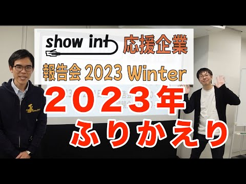
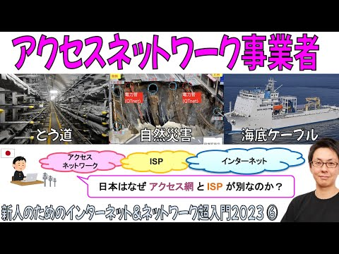
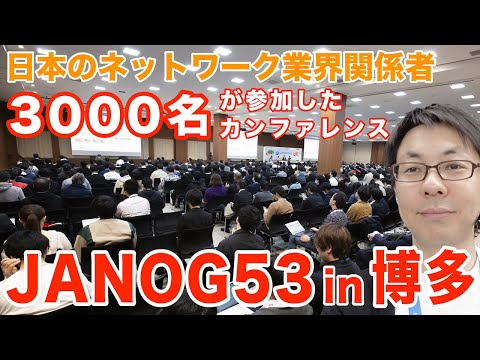
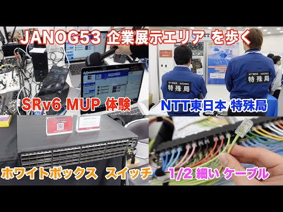
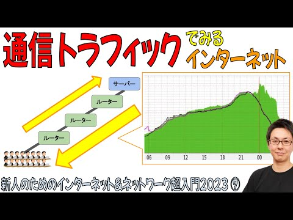
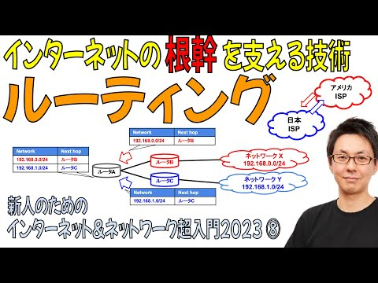

# show int レポート

## 動画名

1. [人生初の転職活動を成功させた 神谷 が伝える「エンジニア転職の最新ノウハウ」](https://www.youtube.com/watch?v=UHsWBL6ZulU) ( 2023-12-25 公開)

1. [show int 応援企業に向けた報告会を開催しました](https://www.youtube.com/watch?v=EfiPKBiaQDY) ( 2023-12-31 公開)

1. [【超入門2023⑥】アクセスネットワーク事業者・海底ケーブルの裏側について解説](https://www.youtube.com/watch?v=u602X43oJow) ( 2024-01-29 公開)

1. [JANOG53 Meeting in 博多 現地レポート【JANOG53 前編】](https://www.youtube.com/watch?v=0GoJgfSb5N8) ( 2024-02-05 公開)

1. [JANOG53 企業展示エリアを散策【JANOG53 in 博多 後編】](https://www.youtube.com/watch?v=TFFpCss21sE) ( 2024-02-13 公開)

1. [海外カンファレンス APNIC56 in 京都 に現地参加しました](https://www.youtube.com/watch?v=d5UTadczKcM) ( 2024-02-19 公開)

1. [【超入門2023⑦】「通信トラフィック」でみるインターネット](https://www.youtube.com/watch?v=5_FF5TemRdM) ( 2024-02-26 公開)

1. [目標設定における「KPI」と「OKR」の違いを解説](https://www.youtube.com/watch?v=rXImv_hm0Nw) ( 2024-03-04 公開)

1. [BIGLOBEネットワークアーキテクト南 雄一さんに聞く「美しいネットワーク設計とは」【前編】【show int x BIGLOBE】](https://www.youtube.com/watch?v=daK0ZzaVaAQ) ( 2024-03-11 公開)

1. [【インタビュー】BIGLOBEネットワークアーキテクト南 雄一さん【前編&amp;後編まとめ】](https://www.youtube.com/watch?v=wbMyttCwkXc) ( 2024-03-14 公開)

1. [大規模 ISPでエンジニアとして活躍できる人材とは 【BIGLOBE 南 雄一さんインタビュー 後編】【show int x BIGLOBE】](https://www.youtube.com/watch?v=MlSNV9u6wpo) ( 2024-03-14 公開)

1. [【超入門2023⑧】「ルーティング」の概念がわかると「インターネットのしくみ」がわかる【6分で解説】](https://www.youtube.com/watch?v=5Mlsgp8ZmRE) ( 2024-03-19 公開)

1. [ネットワーク担当者が知っておくべき「ピアリング交渉」のはじめかた【show int x BIGLOBE】](https://www.youtube.com/watch?v=RSkBvJyJXqo) ( 2024-03-25 公開)

1. [日本国内のISPが海外にネットワーク拠点を持つ理由【本編動画は概要欄から】 #インターネット #BIGLOBE #ISP #ネットワーク #show_int](https://www.youtube.com/watch?v=lbvZyXrDoj4) ( 2024-03-26 公開)

1. [ベテラン ネットワークアーキテクトが語る「美しいネットワーク」とは  #インターネット #BIGLOBE #ISP #ネットワーク #show_int](https://www.youtube.com/watch?v=EpxuLG10L7Y) ( 2024-03-27 公開)

1. [BIGLOBEネットワークチームが掲げる「人材育成の３本柱」とは #BIGLOBE #ISP #ネットワーク #show_int #人材育成](https://www.youtube.com/watch?v=lyWa04KNwP8) ( 2024-03-28 公開)

1. [BIGLOBEがエンジニアとして「採用したい人材」とは #BIGLOBE #ISP #ネットワーク #show_int #採用](https://www.youtube.com/watch?v=88tPjnWtafs) ( 2024-03-29 公開)

|||
|---|---|
|動画名|人生初の転職活動を成功させた 神谷 が伝える「エンジニア転職の最新ノウハウ」|
|動画URL|https://www.youtube.com/watch?v=UHsWBL6ZulU|
|動画公開日|2023-12-25|
|サムネイル||
|再生回数|733|
|グッド回数|22|
|バッド回数|0|
|||

|||
|---|---|
|動画名|show int 応援企業に向けた報告会を開催しました|
|動画URL|https://www.youtube.com/watch?v=EfiPKBiaQDY|
|動画公開日|2023-12-31|
|サムネイル||
|再生回数|325|
|グッド回数|5|
|バッド回数|0|
|||

|||
|---|---|
|動画名|【超入門2023⑥】アクセスネットワーク事業者・海底ケーブルの裏側について解説|
|動画URL|https://www.youtube.com/watch?v=u602X43oJow|
|動画公開日|2024-01-29|
|サムネイル||
|再生回数|1048|
|グッド回数|32|
|バッド回数|0|
|||

|||
|---|---|
|動画名|JANOG53 Meeting in 博多 現地レポート【JANOG53 前編】|
|動画URL|https://www.youtube.com/watch?v=0GoJgfSb5N8|
|動画公開日|2024-02-05|
|サムネイル||
|再生回数|846|
|グッド回数|16|
|バッド回数|0|
|||

|||
|---|---|
|動画名|JANOG53 企業展示エリアを散策【JANOG53 in 博多 後編】|
|動画URL|https://www.youtube.com/watch?v=TFFpCss21sE|
|動画公開日|2024-02-13|
|サムネイル||
|再生回数|1084|
|グッド回数|24|
|バッド回数|0|
|||

|||
|---|---|
|動画名|海外カンファレンス APNIC56 in 京都 に現地参加しました|
|動画URL|https://www.youtube.com/watch?v=d5UTadczKcM|
|動画公開日|2024-02-19|
|サムネイル||
|再生回数|396|
|グッド回数|8|
|バッド回数|0|
|||

|||
|---|---|
|動画名|【超入門2023⑦】「通信トラフィック」でみるインターネット|
|動画URL|https://www.youtube.com/watch?v=5_FF5TemRdM|
|動画公開日|2024-02-26|
|サムネイル||
|再生回数|694|
|グッド回数|22|
|バッド回数|0|
|||

|||
|---|---|
|動画名|目標設定における「KPI」と「OKR」の違いを解説|
|動画URL|https://www.youtube.com/watch?v=rXImv_hm0Nw|
|動画公開日|2024-03-04|
|サムネイル||
|再生回数|363|
|グッド回数|8|
|バッド回数|0|
|||

|||
|---|---|
|動画名|BIGLOBEネットワークアーキテクト南 雄一さんに聞く「美しいネットワーク設計とは」【前編】【show int x BIGLOBE】|
|動画URL|https://www.youtube.com/watch?v=daK0ZzaVaAQ|
|動画公開日|2024-03-11|
|サムネイル||
|再生回数|1040|
|グッド回数|44|
|バッド回数|0|
|||

|||
|---|---|
|動画名|【インタビュー】BIGLOBEネットワークアーキテクト南 雄一さん【前編&amp;後編まとめ】|
|動画URL|https://www.youtube.com/watch?v=wbMyttCwkXc|
|動画公開日|2024-03-14|
|サムネイル||
|再生回数|263|
|グッド回数|11|
|バッド回数|0|
|||

|||
|---|---|
|動画名|大規模 ISPでエンジニアとして活躍できる人材とは 【BIGLOBE 南 雄一さんインタビュー 後編】【show int x BIGLOBE】|
|動画URL|https://www.youtube.com/watch?v=MlSNV9u6wpo|
|動画公開日|2024-03-14|
|サムネイル||
|再生回数|446|
|グッド回数|19|
|バッド回数|0|
|||

|||
|---|---|
|動画名|【超入門2023⑧】「ルーティング」の概念がわかると「インターネットのしくみ」がわかる【6分で解説】|
|動画URL|https://www.youtube.com/watch?v=5Mlsgp8ZmRE|
|動画公開日|2024-03-19|
|サムネイル||
|再生回数|653|
|グッド回数|21|
|バッド回数|0|
|||

|||
|---|---|
|動画名|ネットワーク担当者が知っておくべき「ピアリング交渉」のはじめかた【show int x BIGLOBE】|
|動画URL|https://www.youtube.com/watch?v=RSkBvJyJXqo|
|動画公開日|2024-03-25|
|サムネイル||
|再生回数|563|
|グッド回数|16|
|バッド回数|0|
|||

|||
|---|---|
|動画名|日本国内のISPが海外にネットワーク拠点を持つ理由【本編動画は概要欄から】 #インターネット #BIGLOBE #ISP #ネットワーク #show_int|
|動画URL|https://www.youtube.com/watch?v=lbvZyXrDoj4|
|動画公開日|2024-03-26|
|サムネイル||
|再生回数|509|
|グッド回数|1|
|バッド回数|0|
|||

|||
|---|---|
|動画名|ベテラン ネットワークアーキテクトが語る「美しいネットワーク」とは  #インターネット #BIGLOBE #ISP #ネットワーク #show_int|
|動画URL|https://www.youtube.com/watch?v=EpxuLG10L7Y|
|動画公開日|2024-03-27|
|サムネイル||
|再生回数|308|
|グッド回数|2|
|バッド回数|0|
|||

|||
|---|---|
|動画名|BIGLOBEネットワークチームが掲げる「人材育成の３本柱」とは #BIGLOBE #ISP #ネットワーク #show_int #人材育成|
|動画URL|https://www.youtube.com/watch?v=lyWa04KNwP8|
|動画公開日|2024-03-28|
|サムネイル||
|再生回数|214|
|グッド回数|1|
|バッド回数|0|
|||

|||
|---|---|
|動画名|BIGLOBEがエンジニアとして「採用したい人材」とは #BIGLOBE #ISP #ネットワーク #show_int #採用|
|動画URL|https://www.youtube.com/watch?v=88tPjnWtafs|
|動画公開日|2024-03-29|
|サムネイル||
|再生回数|249|
|グッド回数|5|
|バッド回数|0|
|||

