# show int 年間レポート

## 動画名
|サムネイル|動画名|公開日|再生回数|
|---|---|---|---|
||[【告知】新人のためのインターネット超入門 3時間講演やります 【6/13(火) 13:00 受付開始】](https://www.youtube.com/watch?v=-zfGJIwQUh4)|2023-06-12|615|
||[JANOG52 in 長崎 みどころ紹介【7/5〜7/7開催予定】](https://www.youtube.com/watch?v=XKDZqChFT4I)|2023-06-19|716|
||[【テスト配信】JANOG52講演に向けたテスト配信 &amp; 雑談配信やります](https://www.youtube.com/watch?v=QInGEbTgng0)|2023-06-24|362|
|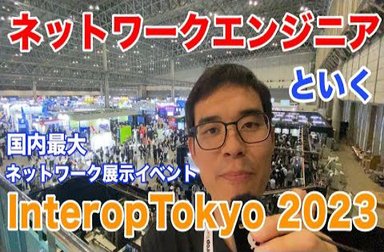|[国内最大級イベント Interop Tokyo 2023 に参加してきました](https://www.youtube.com/watch?v=WhTu9Sf1wN0)|2023-06-26|1549|
||[【講演】新人のためのインターネット&amp;ネットワーク超入門 【JANOG52長崎】【YouTubeLIVE】](https://www.youtube.com/watch?v=X8LS3y5Ie7M)|2023-07-05|5423|
|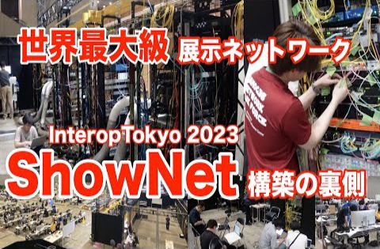|[Interop Tokyo2023を支える ShowNet 構築の裏側](https://www.youtube.com/watch?v=47BsTFssUR8)|2023-07-06|2273|
|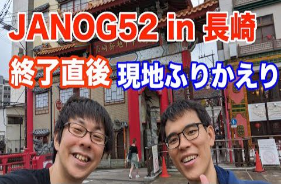|[JANOG52終了直後に現地の様子をふりかえる](https://www.youtube.com/watch?v=GCNZZ810pmk)|2023-07-10|770|
||[ネットワークエンジニア志望の学生/新卒におすすめのIT企業の選び方【就活】](https://www.youtube.com/watch?v=vbBJrTkIsYI)|2023-07-17|1382|
||[配属ガチャに失敗した新人にオススメしたいキャリア戦略](https://www.youtube.com/watch?v=I6IKEMv5XlY)|2023-07-24|662|
|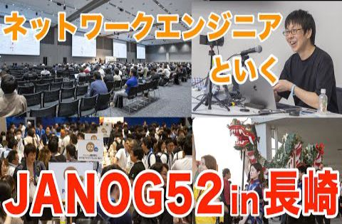|[【JANOG52長崎 ①】2000名のNW業界関係者が集結した JANOG52 in 長崎 を現地レポート](https://www.youtube.com/watch?v=Kv_EaxHzprk)|2023-07-31|774|
|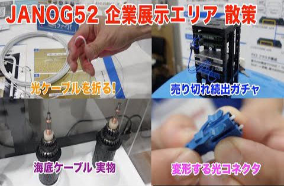|[【JANOG52長崎 ②】ネットワーク企業145社が集まったJANOG52企業展示エリアを散策](https://www.youtube.com/watch?v=tVl8msi-ztg)|2023-08-07|722|
|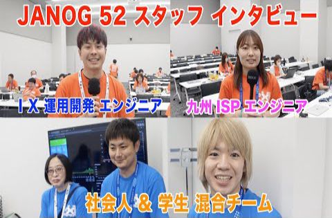|[【JANOG52長崎 ③】学生&amp;若手エンジニアに聞く「JANOGスタッフをやる理由」](https://www.youtube.com/watch?v=m9jyvmtjDH8)|2023-08-14|731|
||[ネットワーク自動化のプログラムをPythonで書いてみた](https://www.youtube.com/watch?v=ha__Bl8OUEM)|2023-08-21|1473|
|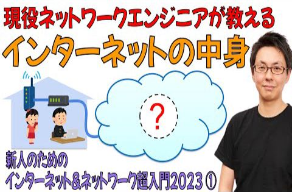|[インターネット超入門2023](https://www.youtube.com/watch?v=)|2023-08-26|2673|
||[【超入門2023①】ネットワーク業界関係者しか知らない「インターネットの中身」](https://www.youtube.com/watch?v=Rarf0iGgyAg)|2023-08-28|2673|
||[なぜあなたが作った自動化ツールは誰にも使われないのか](https://www.youtube.com/watch?v=YYbmk96gTkY)|2023-09-04|571|
||[プログラマーがネットワークエンジニアとして活躍するための条件](https://www.youtube.com/watch?v=UbMKaR4VJjE)|2023-09-11|600|
|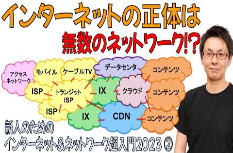|[【超入門2023②】「インターネットの正体」は無数のネットワークが繋がってできている](https://www.youtube.com/watch?v=-JhkpXgltZ8)|2023-09-18|1206|
|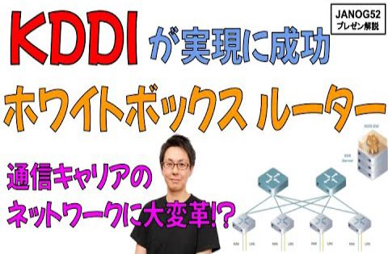|[KDDI が実現に成功した「ホワイトボックス・ルーター」を解説【JANOG52プレゼン解説】](https://www.youtube.com/watch?v=dTeL-nUMvfE)|2023-09-25|1780|
|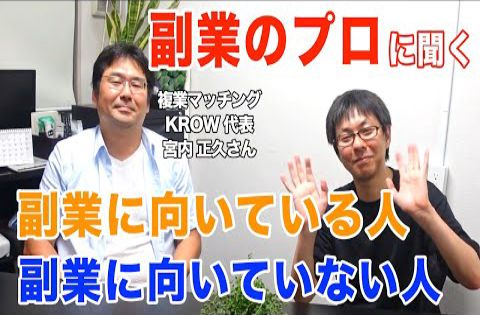|[副業のプロに聞く！副業に向いている人、副業に向いていない人](https://www.youtube.com/watch?v=x332_QWLqII)|2023-10-02|445|
|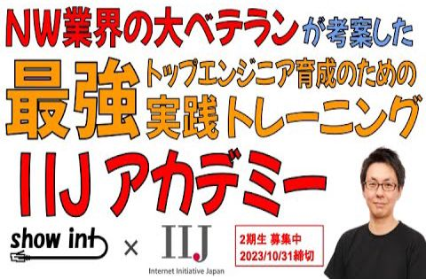|[トップエンジニア育成プログラム「IIJアカデミー」を解説 【2期生募集中 10/31締切】](https://www.youtube.com/watch?v=ttTcbbrOl5g)|2023-10-11|1324|
||[サイバーエージェントが構築した AI/ML専用インフラのネットワーク要件がヤバすぎた【JANOG52プレゼン解説】](https://www.youtube.com/watch?v=K83YRt_jDY4)|2023-10-16|1326|
|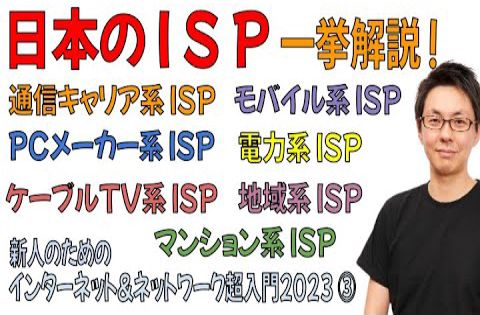|[【超入門2023③】日本のISP (インターネットサービスプロバイダ) を一気に解説](https://www.youtube.com/watch?v=hlGeHJUdGT4)|2023-10-23|1695|
||[「EVPNマルチホーミング」から学ぶ ネットワーク機器 冗長化技術 の過去と未来【JANOG52プレゼン解説】](https://www.youtube.com/watch?v=ssQo608m31o)|2023-10-30|1064|
||[技術についていけなくなる将来の不安に対するアドバイス](https://www.youtube.com/watch?v=GEicptmkEZg)|2023-11-06|868|
||[ネットワークエンジニアの転職面接でされる質問と対策](https://www.youtube.com/watch?v=8yJnGeNNhZc)|2023-11-13|902|
||[【超入門2023④】クラウド事業者・データセンタ事業者・CDN事業者・コンテンツ事業者の違いを解説](https://www.youtube.com/watch?v=SX7zeKzT08M)|2023-11-20|903|
|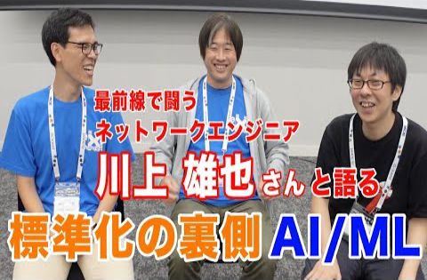|[最前線で闘うネットワークエンジニア 川上 雄也 さん #標準化 #IETF #RFC #3GPP #AI/ML【エンジニア対談】](https://www.youtube.com/watch?v=t1TCyl7Xg-0)|2023-11-27|775|
|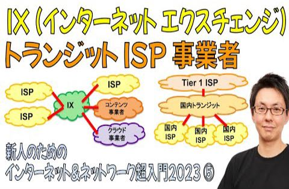|[【超入門2023⑤】IX・トランジット を理解するとインターネットの業界構造がみえてくる](https://www.youtube.com/watch?v=MaKhbTaJAyE)|2023-12-05|1183|
||[Twitch 韓国からの撤退「韓国のネットワークコストが10倍」である理由](https://www.youtube.com/watch?v=moUiq5xf9Q4)|2023-12-11|1493|
||[show int 神谷が人生初の『転職』に成功しました #外資系 #エンジニア転職](https://www.youtube.com/watch?v=wlvjRKOEZxA)|2023-12-18|758|
||[人生初の転職活動を成功させた 神谷 が伝える「エンジニア転職の最新ノウハウ」](https://www.youtube.com/watch?v=UHsWBL6ZulU)|2023-12-25|744|
|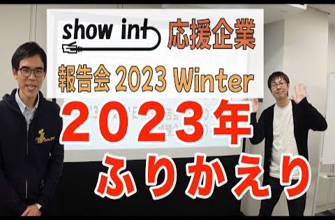|[show int 応援企業に向けた報告会を開催しました](https://www.youtube.com/watch?v=EfiPKBiaQDY)|2023-12-31|328|
||[JANOG53開催直前! 注目プログラムを紹介します【2024年1月17-19日開催予定】](https://www.youtube.com/watch?v=vAq_6X10LBc)|2024-01-08|511|
||[モバイルネットワーク専門家が語る「モバイルインターネットの過去・未来・現在」【3G・4G・5G】【ローカル5G】【6G時代は何がくる？】](https://www.youtube.com/watch?v=FjCNDp4XgnA)|2024-01-11|627|
|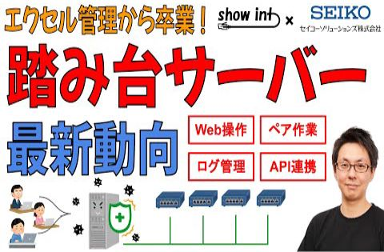|[「踏み台サーバー」ってなに？ 運用失敗あるある事例と最新動向 【show int x セイコーソリューションズ コラボ企画】](https://www.youtube.com/watch?v=NU-2aNYGFd4)|2024-01-15|1415|
||[JANOG53 in 博多 で面白かったプログラムを振り返ってみた](https://www.youtube.com/watch?v=IgeDskcLp1E)|2024-01-22|723|
|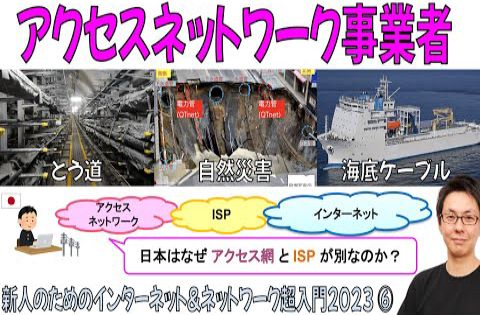|[【超入門2023⑥】アクセスネットワーク事業者・海底ケーブルの裏側について解説](https://www.youtube.com/watch?v=u602X43oJow)|2024-01-29|1102|
|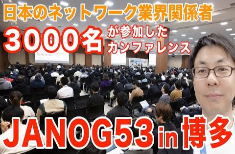|[JANOG53 Meeting in 博多 現地レポート【JANOG53 前編】](https://www.youtube.com/watch?v=0GoJgfSb5N8)|2024-02-05|855|
|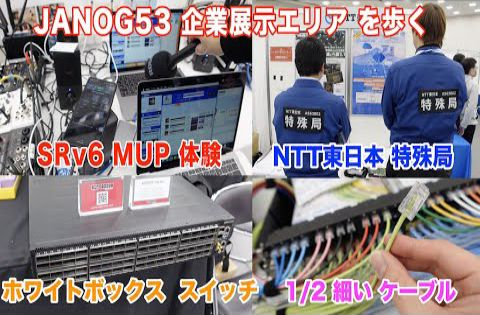|[JANOG53 企業展示エリアを散策【JANOG53 in 博多 後編】](https://www.youtube.com/watch?v=TFFpCss21sE)|2024-02-13|1097|
||[海外カンファレンス APNIC56 in 京都 に現地参加しました](https://www.youtube.com/watch?v=d5UTadczKcM)|2024-02-19|398|
|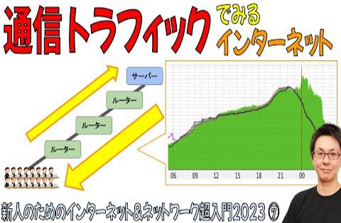|[【超入門2023⑦】「通信トラフィック」でみるインターネット](https://www.youtube.com/watch?v=5_FF5TemRdM)|2024-02-26|775|
||[目標設定における「KPI」と「OKR」の違いを解説](https://www.youtube.com/watch?v=rXImv_hm0Nw)|2024-03-04|382|
|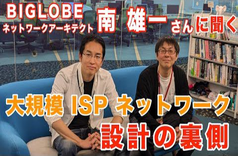|[BIGLOBEネットワークアーキテクト南 雄一さんに聞く「美しいネットワーク設計とは」【前編】【show int x BIGLOBE】](https://www.youtube.com/watch?v=daK0ZzaVaAQ)|2024-03-11|1072|
||[【インタビュー】BIGLOBEネットワークアーキテクト南 雄一さん【前編&amp;後編まとめ】](https://www.youtube.com/watch?v=wbMyttCwkXc)|2024-03-14|291|
||[大規模 ISPでエンジニアとして活躍できる人材とは 【BIGLOBE 南 雄一さんインタビュー 後編】【show int x BIGLOBE】](https://www.youtube.com/watch?v=MlSNV9u6wpo)|2024-03-14|468|
|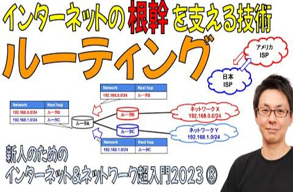|[【超入門2023⑧】「ルーティング」の概念がわかると「インターネットのしくみ」がわかる【6分で解説】](https://www.youtube.com/watch?v=5Mlsgp8ZmRE)|2024-03-19|729|
||[ネットワーク担当者が知っておくべき「ピアリング交渉」のはじめかた【show int x BIGLOBE】](https://www.youtube.com/watch?v=RSkBvJyJXqo)|2024-03-25|607|
||[日本国内のISPが海外にネットワーク拠点を持つ理由【本編動画は概要欄から】 #インターネット #BIGLOBE #ISP #ネットワーク #show_int](https://www.youtube.com/watch?v=lbvZyXrDoj4)|2024-03-26|514|
||[ベテラン ネットワークアーキテクトが語る「美しいネットワーク」とは  #インターネット #BIGLOBE #ISP #ネットワーク #show_int](https://www.youtube.com/watch?v=EpxuLG10L7Y)|2024-03-27|320|
